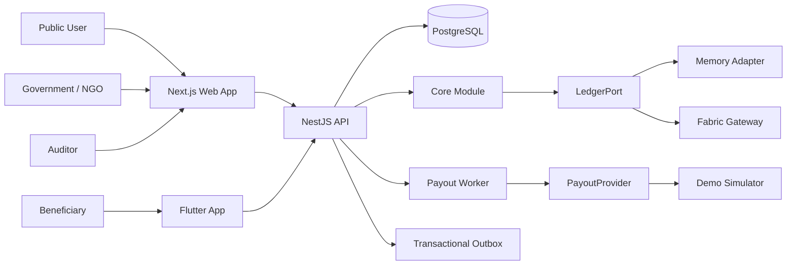
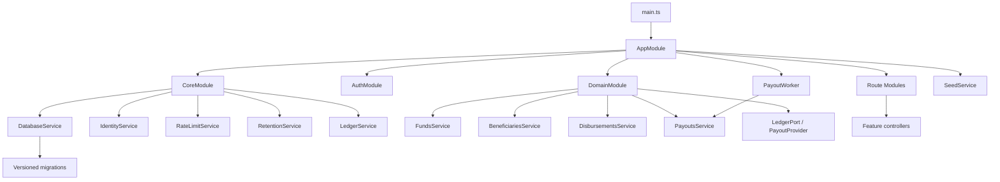
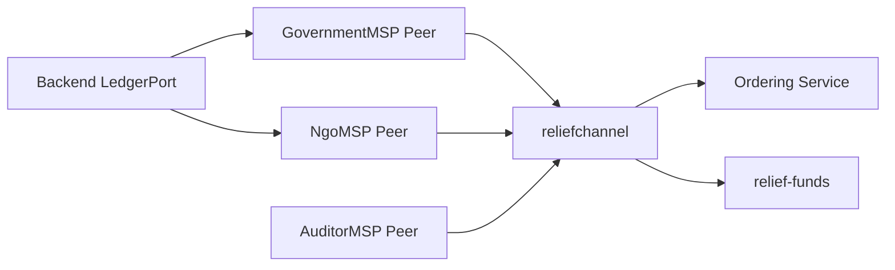
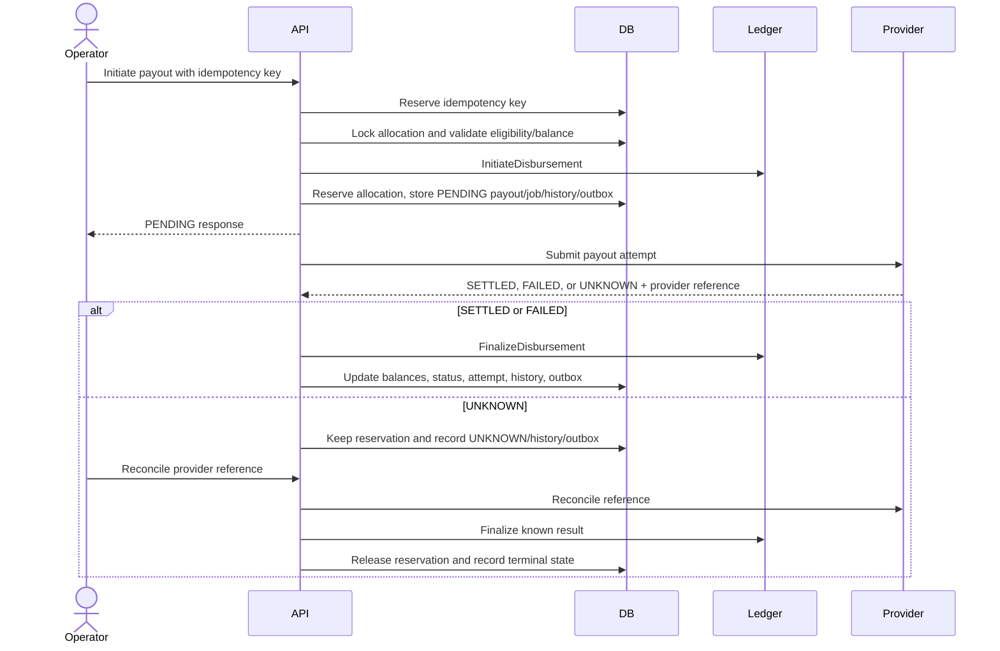

# ReliefChain Architecture 2

This document describes the current ReliefChain architecture after the backend contract, modularization, persistence, authentication, privacy, and payout-orchestration work. It keeps the structure of `ARCHITECTURE.md` while recording the newer implementation state.

For the backend request-level workflow, see [BACKEND_WORKFLOW.md](BACKEND_WORKFLOW.md). For shared contracts, see [BACKEND_CONTRACTS.md](BACKEND_CONTRACTS.md). For work owned by other teams, see [OTHER_TEAMS_WORK.md](OTHER_TEAMS_WORK.md).

## 1. System Overview



ReliefChain has four main parts:

| Part | Technology | Responsibility |
|---|---|---|
| Web frontend | Next.js | Public dashboard, operator portal, auditor portal |
| Mobile frontend | Flutter | Beneficiary OTP login and payment status |
| Backend | NestJS and PostgreSQL | Authentication, authorization, workflows, privacy, migrations, jobs, projections, and queries |
| Blockchain | Hyperledger Fabric | Immutable financial events, authorization, and balance rules |

The zero-Docker `apps/demo-api` remains a separate in-memory API for frontend demonstrations. It is not the real backend.

## 2. Current Repository Structure

```text
apps/
  web/                     Next.js frontend
  api/                     Real NestJS backend
    src/
      auth/                Login, OTP provider, JWT, sessions, roles
      controllers/         Public, operator, beneficiary, audit, health
      migrations/          Versioned PostgreSQL migrations
      *.service.ts         Domain and infrastructure services
  demo-api/                In-memory local demonstration API
mobile/                    Flutter beneficiary application
packages/
  contracts/               Shared validation, types, and privacy helpers
fabric/
  chaincode/               Fabric smart-contract code
  network/                 Fabric organizations and network configuration
scripts/                   Fabric startup, deployment, and smoke tests
```

## 3. Current Backend Structure

The real backend is one NestJS application under `apps/api`, split into shared infrastructure, authentication, domain, and route modules.



### Backend file responsibilities

| Area | Current responsibility | Safe owner |
|---|---|---|
| `main.ts` | Starts NestJS, configures CORS, global prefix, validation, and Swagger | Backend platform |
| `app.module.ts` | Composes core, auth, domain, route modules, worker, and seed service | Backend lead |
| `core.module.ts` | Provides database, ledger, identity, rate limits, and retention services | Backend platform/data |
| `auth/` | Staff login, beneficiary OTP, refresh sessions, JWT guard, role metadata, OTP port | Backend auth |
| `controllers/` | HTTP transport, request validation, route authorization metadata, and response mapping | Backend API |
| `funds.service.ts` | Fund source creation, ownership, allocation, balance validation, and outbox events | Backend domain |
| `beneficiaries.service.ts` | Eligibility commitment, identity protection, encrypted contact storage, and beneficiary view | Backend privacy/domain |
| `disbursements.service.ts` | Idempotency reservation, payout initiation, batches, reversal, reconciliation, and transition history | Backend payments/domain |
| `payouts.service.ts` | Provider attempts, settlement/failure, UNKNOWN handling, ledger finalization, and outbox events | Backend payments |
| `ledger.ts` and `ports.ts` | Memory/Fabric ledger adapter and integration boundary | Backend/blockchain integration |
| `database.service.ts` and `migrations/` | PostgreSQL pool, transactions, advisory-locked migration runner, and schema evolution | Backend data |
| `worker.ts` | Polls due payout jobs and delegates finalization | Backend payments |
| `retention.service.ts` | Explicit cleanup for expired ephemeral operational data | Backend platform/data |

`ReliefService` remains a compatibility facade for seed and worker callers. `controllers.ts` and `auth.ts` remain compatibility sources/barrels and are not the primary registered implementations.

## 4. Backend Request Flow

Every request follows this path:

```text
Browser or mobile app
        ↓
NestJS controller under /api/v1
        ↓
JWT validity and revocation check, then role metadata
        ↓
Controller input validation and rate limit where applicable
        ↓
Feature application service
        ↓
Ownership, district, eligibility, amount, state, and idempotency checks
        ↓
LedgerPort / PayoutProvider when required
        ↓
PostgreSQL projection, history, outbox, or response
```

Controllers do not own financial rules. Application/domain services enforce invariants, and ledger calls remain behind ports.

## 5. Backend API Groups

All real backend routes use the `/api/v1` prefix.

| Route group | User | Purpose |
|---|---|---|
| `/public/*` | Anyone | Dashboard totals, district aggregates, proof lookup |
| `/auth/login` | Staff | Password login, short-lived access token, refresh session |
| `/auth/otp/*` | Beneficiary | Rate-limited mock/provider OTP request and verification |
| `/auth/refresh` | Staff or beneficiary | Rotate a valid refresh session |
| `/auth/logout` | Authenticated user | Revoke access token and refresh session |
| `/operator/*` | Government or NGO | Sources, allocations, beneficiaries, disbursements, batches, reversals, reconciliation |
| `/beneficiary/me` | Beneficiary | Own private eligibility and payment history |
| `/audit/*` | Auditor | Events, reconciliation, cursor reads, and CSV export |
| `/health` | Platform | Database/API health and active ledger mode |
| `/docs` | Developers | Swagger under `/api/v1/docs` |

### Role rules

| Role | Allowed operations |
|---|---|
| `GOVERNMENT` | Government-owned sources, allocations, batches, and related payout workflows |
| `NGO` | NGO-owned sources, allocations, batches, and related payout workflows |
| `AUDITOR` | Read audit events, reconciliation, and exports |
| `BENEFICIARY` | Read only the authenticated beneficiary record |

Organization and district scope are enforced in both route metadata and domain policies. Government users cannot operate NGO-owned records, and NGO users cannot operate government-owned records.

## 6. Data Storage

### PostgreSQL stores

- Staff and beneficiary refresh sessions, revoked token IDs, and hashed refresh tokens.
- Staff accounts and password hashes.
- Encrypted beneficiary name/phone and phone lookup hashes.
- Hashed OTP challenges and expiry.
- Disasters, schemes, sources, allocations, beneficiaries, and disbursement projections.
- Payout jobs, batches, provider attempts, dead letters, status history, and provider references.
- Idempotency reservations and transactional outbox events.
- API audit actions, annotations, ledger events, and indexer checkpoint metadata.
- PostgreSQL-shared rate-limit buckets.

### Fabric stores

- Disaster and scheme registration.
- Fund source creation and allocation.
- HMAC beneficiary commitments.
- Disbursement initiation, settlement/failure, and reversal.

### Never store on Fabric

- Synthetic Aadhaar-like values.
- Phone numbers or beneficiary names.
- OTPs, bank-account data, encryption keys, JWT secrets, or raw private contact data.

## 7. Privacy Flow

When an operator registers a beneficiary:

1. The API validates the synthetic 12-digit identifier, name, phone, district, and scheme.
2. `IdentityService` creates an HMAC-SHA-256 beneficiary reference using the current HMAC key version.
3. It encrypts the name and phone with AES-256-GCM using the current encryption key version.
4. PostgreSQL stores encrypted contact data and a phone lookup hash; the raw identifier is discarded.
5. Fabric receives only the beneficiary reference, district, scheme, and privacy-safe event data.
6. Projection payloads pass through sensitive-field redaction before storage.

The identity service can read configured previous encryption/HMAC key versions for controlled rotation. Public and auditor routes expose only privacy-filtered data.

## 8. Ledger Modes

`LedgerService` supports modes selected by `LEDGER_MODE`.

### Memory mode

```text
LEDGER_MODE=memory
```

- Generates development transaction IDs.
- Records safe receipt/event projections in PostgreSQL.
- Does not use Hyperledger Fabric.
- Intended for API development when Docker/Fabric is unavailable.

### Fabric mode

```text
LEDGER_MODE=fabric
```

- Connects with organization-specific gateway credentials.
- Uses GovernmentMSP or NgoMSP identities according to ownership.
- Submits transactions and waits for commit status.
- Returns Fabric transaction and block metadata.

Memory receipts are development proofs and must not be presented as real Fabric proofs.

## 9. Blockchain Structure

The Fabric network uses channel `reliefchannel` and chaincode package `relief-funds`.



| Organization | Current purpose |
|---|---|
| `GovernmentMSP` | Government-owned financial writes |
| `NgoMSP` | NGO-owned financial writes |
| `AuditorMSP` | Independent read/verification copy |
| `OrdererMSP` | Orders channel transactions |

Application authorization is an additional control and does not replace chaincode authorization or endorsement.

## 10. Payout Flow

Payouts use a provider abstraction and remain simulated unless a real approved provider is integrated.



Batches move through `DRAFT`, `PENDING_APPROVAL`, `APPROVED`, and `SUBMITTED`; approval requires a different operator from the creator. Reversals are allowed only for owned settled payouts and require a non-empty reason.

## 11. Demo API Versus Real Backend

| Feature | `apps/demo-api` | `apps/api` |
|---|---|---|
| Purpose | Frontend demonstration | Real application backend |
| Database | In-memory JavaScript objects | PostgreSQL with versioned migrations |
| Ledger | Fake development proofs | LedgerPort memory adapter or Fabric |
| Persistence | Lost on restart | Persistent projections, history, sessions, and outbox |
| Authentication | In-memory demo tokens | JWT, refresh sessions, Argon2, OTP provider, revocation |
| Privacy | Synthetic in-memory fixtures | AES-GCM, HMAC, hashes, key rings, redaction |
| Provider | Simulated in-memory behavior | PayoutProvider with simulated adapter unless replaced |
| Swagger | No | Yes |
| Use in pilot | Never | Yes, after acceptance gates |

## 12. Work Division

### Backend team

Owns the API, database/migrations, authentication, identity/privacy, payout orchestration, ledger adapter boundary, worker, tests, and backend documentation.

### Frontend web team

Owns `apps/web`, generated API client usage, route/session states, operator/auditor/public workflows, accessibility, localization, and web E2E tests.

### Mobile team

Owns `mobile`, Android wrappers, secure token storage, OTP/session UX, offline/cache behavior, localization, accessibility, device tests, and release builds.

### Blockchain team

Owns `fabric/chaincode`, `fabric/network`, lifecycle, CA/MSP, endorsement, event schemas, and multi-organization Fabric testing. Works jointly with backend on `LedgerPort`, event fixtures, and transaction compatibility.

### Platform team

Owns environments, secrets manager, CI/CD, image publication/scanning, telemetry, TLS, backups, restore drills, and scheduled retention cleanup.

### QA/security team

Owns cross-system fixtures, RBAC/privacy scans, integration/resilience/performance tests, accessibility evidence, and release gates.

## 13. Recommended Upgrade Order

1. Freeze shared API, state, money, RBAC, event, and environment contracts.
2. Complete PostgreSQL and Fabric integration environments.
3. Replace the current worker poller with atomic leasing, backoff, dead letters, and restart recovery.
4. Add durable Fabric block-event indexing and projection replay.
5. Integrate real notification/provider adapters only after compliance approval.
6. Harden telemetry, secrets, backups, restore, accessibility, performance, and security evidence.
7. Pass pilot acceptance gates before making production claims.

## 14. Interfaces Teams Must Agree On

Before parallel implementation or breaking changes, freeze:

1. Versioned OpenAPI request/response shapes and error format.
2. Integer paise money representation and `INR` semantics.
3. UUID entities, public references, beneficiary references, and key-version formats.
4. Role, organization, and district permissions.
5. Disbursement and payout-batch states and transitions.
6. `LedgerPort` arguments, receipts, commit metadata, and event payloads.
7. `PayoutProvider` submit/reconcile results and provider-reference semantics.
8. Outbox event names and payload allowlists.
9. Environment and secret names.
10. Shared fixture IDs, expected balances, and recovery scenarios.

## 15. Current Limitations

- Live PostgreSQL migration-upgrade and full API integration tests still require test infrastructure.
- Worker jobs do not yet use atomic multi-worker leasing, exponential backoff, or operational dead-letter actions.
- The real notification provider is not implemented; mock OTP is development-only.
- Structured logs/traces/metrics are not yet wired to the redaction utility.
- Fabric projection still records API receipts; durable peer block-event replay remains a later indexer phase.
- Fabric remains a single-host hackathon topology with demo identity lifecycle.
- Real payouts, UIDAI integration, personal data on Fabric, and nationwide production claims are out of scope.

## 16. Definition of Done for Architecture Work

The architecture is ready for the next integration stage when:

- Current backend routes and contracts are documented and checked in.
- Migrations create a fresh database and upgrade an MVP snapshot.
- Auth, organization, district, idempotency, state, privacy, and balance tests pass.
- Provider timeout, UNKNOWN reconciliation, worker restart, and duplicate scenarios are safe.
- Fabric events can rebuild PostgreSQL projections from a trusted checkpoint.
- Other teams use the same OpenAPI, event, state, money, and RBAC contracts.
- No prohibited PII or secrets appear in Fabric, public responses, telemetry, exports, or source control.
- Deployment, rollback, restore, key rotation, certificate rotation, and incident evidence is recorded.
