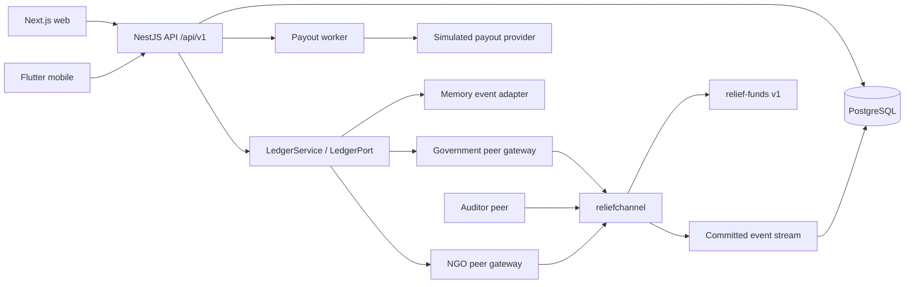
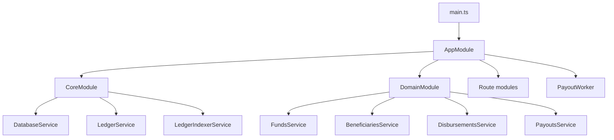
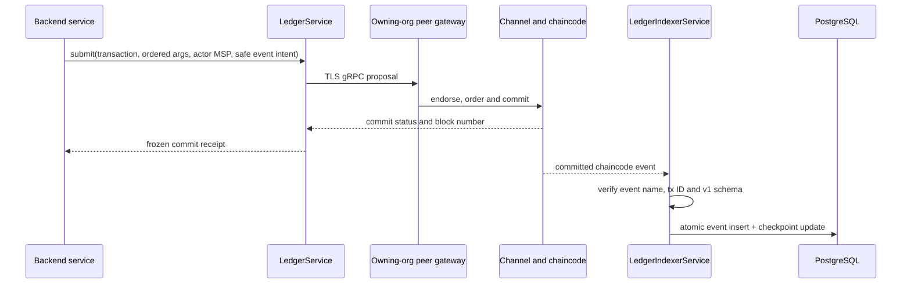

# ReliefChain Final MVP Architecture

Status: hackathon MVP baseline, 26 August 2026.

This is the only architecture document for ReliefChain. `BACKEND_CONTRACTS.md` remains the interface source of truth, `BACKEND_WORKFLOW.md` describes request-level behavior, and `blockchainUpgrade.md` records deferred blockchain hardening.

## 1. Scope and MVP assumptions

ReliefChain demonstrates traceable disaster-relief allocations and simulated beneficiary payouts. It is not a production banking system.

The MVP assumes:

- One developer-controlled Docker host runs PostgreSQL, the API, the web app, and the Fabric network.
- Fabric has Government, NGO, and Auditor peers on one channel. It is a demonstration topology, not a fault-tolerant production deployment.
- `cryptogen` identities, a development ordering service, and the current channel policy are acceptable for the hackathon. Fabric CA enrollment, certificate rotation, HSM-backed keys, state-based endorsement, disaster recovery, and multi-host deployment are deferred.
- Payouts and OTP delivery are simulated. No real money, UIDAI service, Aadhaar record, bank account, or production notification provider is used.
- PostgreSQL owns private operational data and API read models. Fabric owns immutable financial state and privacy-safe accepted-transition events.
- Ledger contract v1 has eight frozen write transactions. Prepared v2 domain types such as `UNKNOWN`, batches, transition assets, and linked reversals are not exposed as Fabric transactions or world-state assets.
- `UNKNOWN` is PostgreSQL-only in v1. Fabric retains the payout as `PENDING` until reconciliation submits `SETTLED` or `FAILED`.
- A successful automated test run verifies code behavior. A real Fabric claim additionally requires a running Docker/WSL environment and the live smoke test described below.

## 2. System overview



The frontend never connects to a peer directly. Every write passes through the API, which selects an organization gateway identity. Public and authenticated reads come from PostgreSQL-backed API routes.

## 3. Final repository structure

```text
apps/
  api/                         Real NestJS backend
    src/
      auth/                    Login, OTP, refresh sessions, JWT and roles
      controllers/             Public, operator, beneficiary, audit and health HTTP routes
      migrations/              Ordered PostgreSQL migrations 001-011
      repositories/            Ledger/audit and projection persistence helpers
      beneficiaries.service.ts Private identity and eligibility workflow
      disbursements.service.ts  Initiation, batches, reconciliation and reversal workflow
      funds.service.ts          Fund sources and allocations
      payouts.service.ts        Provider attempts and terminal payout handling
      worker.ts                 Leasing, retries and dead-letter processing
      ledger.ts                 Memory/Fabric submission adapter
      ledger-indexer.service.ts Committed Fabric chaincode-event consumer
      database.service.ts       PostgreSQL pool and transaction boundary
      identity.service.ts       HMAC references and AES-GCM protected contacts
  web/                         Next.js frontend; not configured in this change
  demo-api/                    In-memory UI demo only; not the real backend
mobile/                        Flutter beneficiary client; not configured in this change
packages/
  contracts/                   Shared API/privacy and frozen ledger-v1 schemas/fixtures
fabric/
  chaincode/src/
    domain.ts                  Pure v1 compatibility and prepared, unexposed v2 model
    relief-contract.ts         Frozen v1 Fabric handlers and privacy-safe events
  network/                     Channel, peers, orderer and generated credentials
scripts/
  fabric-up.sh                 Creates identities, starts peers, joins reliefchannel
  deploy-chaincode.sh          Packages, approves and commits relief-funds
  smoke-test.mjs               End-to-end application smoke workflow
```

## 4. Backend composition



All real routes use `/api/v1`. Swagger is served at `/api/v1/docs`. Controllers handle HTTP validation and authorization metadata; services own business rules; `LedgerPort` isolates Fabric; repositories/database transactions own persistence.

### PostgreSQL startup

`DatabaseService` runs migrations under a PostgreSQL advisory transaction lock. The runner registers every migration from `001_initial` through `011_payout_job_status_default`, including worker leases, indexer status/rebuild tracking, correlation IDs, and the required default job state. A fresh database and an upgraded MVP database therefore use the same ordered migration path.

PostgreSQL stores private identities, encrypted contact data, sessions, rate-limit buckets, operational projections, jobs, attempts, batches, status history, outbox records, audit events, and the Fabric event checkpoint.

### Payout state

The backend supports:

```text
PENDING -> SETTLED | FAILED | UNKNOWN
UNKNOWN -> SETTLED | FAILED
SETTLED -> REVERSED
```

The worker can be disabled with `WORKER_ENABLED=false`; otherwise it is enabled by default. It leases jobs, records attempts, retries with bounded exponential backoff, and dead-letters exhausted work.

## 5. Frozen Fabric ledger v1

The exposed write surface is exactly:

| Transaction | Positional arguments |
|---|---|
| `RegisterDisaster` | `id, name, stateCode` |
| `RegisterScheme` | `id, disasterId, name` |
| `CreateFundSource` | `id, disasterId, sourceType, name, amountPaise` |
| `AllocateFunds` | `id, sourceId, schemeId, districtCode, amountPaise` |
| `RegisterBeneficiaryCommitment` | `beneficiaryRef, districtCode, schemeId` |
| `InitiateDisbursement` | `id, publicReference, allocationId, beneficiaryRef, amountPaise, idempotencyKey` |
| `FinalizeDisbursement` | `id, status, providerReferenceHash, reasonCode` |
| `ReverseDisbursement` | `id, reasonCode` |

Chaincode now:

- Accepts paise only as canonical positive decimal strings up to `1000000000000`.
- Returns privacy-safe asset views rather than stored private linkage fields.
- Emits the strict v1 envelope with Fabric transaction timestamp, transaction ID, actor MSP, and an allowlisted payload.
- Uses a transaction-derived opaque ID for `BeneficiaryCommitted` events.
- Stores/emits a SHA-256 provider-reference hash, never a raw provider or bank reference.
- Stores stable failure/reversal reason codes, not investigation text in deprecated `failureReason`.
- Prefixes errors with stable `LEDGER_*` codes.
- Emits no accepted-transition event when validation rejects a transaction.
- Filters `ReadAsset` and `GetHistory` values through the same privacy-safe views.

`domain.ts` also contains future-v2 pure types and transitions. They remain deliberately unreachable from the Fabric transaction surface until a v2 ADR and shared schemas are approved.

## 6. API-to-peer connection



Government-owned operations use `FABRIC_GOVERNMENT_*`; NGO-owned operations use `FABRIC_NGO_*`. Both API and Fabric containers join Docker network `reliefchain_fabric`, so the API resolves `peer0.government.example.com:7051` and `peer0.ngo.example.com:9051` by container name. TLS roots and User1 signing credentials are generated by `scripts/fabric-up.sh` into `fabric/network/credentials` and mounted read-only into the API container.

The indexer uses `Network.getChaincodeEvents()` from the installed Fabric Gateway SDK. It resumes inclusively from the stored block so duplicate delivery is safe, validates the envelope before persistence, and stores the event plus checkpoint in one PostgreSQL transaction. It no longer calls nonexistent `getBlock()` methods and never advances a checkpoint after failed persistence. An invalid/unsupported event stops the indexer and makes health degraded instead of silently skipping evidence.

In Fabric mode, `LedgerService` does not write an API-predicted event to `ledger_events`; only the committed peer stream is authoritative. In memory mode, it writes the same validated privacy-safe event shape directly for local backend development.

For this MVP, the committed-event index is an audit/proof index. It does not recreate encrypted beneficiaries, idempotency keys, provider attempts, or other private operational rows because those fields are intentionally absent from Fabric events. PostgreSQL business projections remain API-owned.

## 7. Privacy and trust boundaries

Never put raw synthetic Aadhaar-like values, names, phone numbers, OTPs, idempotency keys, raw provider/bank references, provider error text, secrets, or investigation notes into Fabric events, public/audit payloads, or logs.

- Beneficiary linkage on Fabric is an HMAC reference; its event ID is opaque.
- Names and phones are AES-256-GCM encrypted in PostgreSQL.
- Phone lookup is hashed.
- Raw provider references and detailed failure/reversal notes remain PostgreSQL-only.
- Fabric gets at most `sha256:<64 lowercase hex>` and stable uppercase reason codes.
- Memory-mode receipts are development evidence, not blockchain proof.

## 8. Backend usage

### A. Fast MVP backend in memory-ledger mode

Prerequisites: Node.js 20+, npm, a running PostgreSQL 16 instance, and a completed `.env` based on `.env.example`.

```powershell
npm install
npm run migrate -w @reliefchain/api
npm run seed -w @reliefchain/api
npm run dev -w @reliefchain/api
```

Or start PostgreSQL and the API with Docker:

```powershell
docker compose up --build -d postgres api
docker compose ps
Invoke-RestMethod http://localhost:4000/api/v1/health
```

Use `LEDGER_MODE=memory`. Swagger is at `http://localhost:4000/api/v1/docs`. This mode verifies API, PostgreSQL, authentication, jobs, privacy, and workflows without proving Fabric.

### B. Backend with the real local Fabric ledger

Prerequisites: Docker Desktop with the Linux engine running, WSL2 or another Bash environment, Node.js 20+, npm, and the configured `.env`.

```bash
bash scripts/fabric-up.sh
bash scripts/deploy-chaincode.sh
```

Then set `LEDGER_MODE=fabric` and start the API on the shared Docker network:

```powershell
docker compose up --build -d postgres api
docker compose ps
Invoke-RestMethod http://localhost:4000/api/v1/health/ready
node scripts/smoke-test.mjs
```

Expected readiness: database, ledger, and indexer report `ready`. If the API container started before Fabric credentials existed, recreate it after `fabric-up.sh`.

Useful checks:

```powershell
docker compose logs --tail 200 api
docker compose exec postgres psql -U reliefchain -d reliefchain -c "SELECT id, applied_at FROM schema_migrations ORDER BY id;"
docker compose exec postgres psql -U reliefchain -d reliefchain -c "SELECT * FROM indexer_checkpoint;"
docker compose exec postgres psql -U reliefchain -d reliefchain -c "SELECT sequence,event_name,transaction_id,block_number FROM ledger_events ORDER BY sequence DESC LIMIT 20;"
```

### C. Verification commands

```powershell
npm run typecheck -w @reliefchain/contracts
npm test -w @reliefchain/contracts
npm run build -w @reliefchain/contracts
npm run typecheck -w @reliefchain/chaincode
npm test -w @reliefchain/chaincode
npm run build -w @reliefchain/chaincode
npm run typecheck -w @reliefchain/api
npm test -w @reliefchain/api
npm run build -w @reliefchain/api
```

## 9. Frontend usage — not configured in this change

No frontend or Flutter configuration was changed. Once the backend is healthy, web developers may use:

```powershell
$env:NEXT_PUBLIC_API_URL="http://localhost:4000/api/v1"
npm run dev -w @reliefchain/web
```

The web application is normally available at `http://localhost:3000`. For full Docker proxy usage, start `web` and `caddy` only after API readiness:

```powershell
docker compose up --build -d web caddy
```

Flutter remains a separate client under `mobile/` and should point its API configuration at the same `/api/v1` base URL. Frontend teams must not infer that `memory` receipts are real Fabric proofs; the API exposes the active ledger mode.

## 10. Implemented changes in this consolidation

- Registered migrations 008 through 011 and asserted the complete order in tests.
- Replaced the invalid block-polling indexer with the Fabric Gateway committed chaincode-event stream.
- Made peer-event persistence and checkpoint advancement atomic and fail-closed.
- Stopped API-side predicted event recording in Fabric mode; retained validated event recording in memory mode.
- Added actual indexer connection state to readiness/health instead of treating configuration as connectivity.
- Updated LedgerPort submission metadata so organization identity selection is explicit rather than inferred from payload fields.
- Hashed provider references before Fabric submission and converted on-chain failure/reversal details to stable reason codes.
- Upgraded all frozen v1 chaincode handlers to privacy-safe returns, strict versioned events, canonical amounts, stable errors, and filtered reads/history.
- Added chaincode-to-shared-contract compatibility tests.
- Corrected redaction so safe numeric/boolean/null values keep their types.
- Made worker enablement explicit and documented its operational environment settings.
- Expanded `.env.example` and Compose wiring without modifying the developer’s real `.env`.
- Removed the superseded `ARCHITECTURE-2.md` and `docs/ARCHITECTURE.md` documents.

## 11. Known MVP limitations and deferred work

- Live Docker/Fabric/peer connectivity is environment-dependent and must be proven with the live smoke test; repository tests mock the network boundary.
- Fabric still uses `cryptogen`, demo User1 gateway identities, pinned version tags rather than image digests, and a single-host topology.
- Channel endorsement and high-risk reversal oversight are not production-hardened.
- Ledger submission and the following PostgreSQL operational write cannot be one distributed ACID transaction. Production work should add a durable command/outbox recovery design.
- The indexer rebuilds only the privacy-safe ledger-event audit index, not private PostgreSQL operational projections.
- One v1 transaction is expected to emit one accepted event. A future contract supporting multiple events per transaction needs an explicit event index in the database key/checkpoint.
- Event-stream height is not separately queried, so `projectionLag` is reported as `null` rather than inventing a block-height delta.
- `ReadAsset` and `GetHistory` are privacy-filtered but unbounded history and richer query pagination remain future hardening.
- Prepared v2 domain concepts, Fabric CA lifecycle, state-based endorsement, snapshot/restore drills, certificate rotation, observability backends, real providers, and production security evidence remain deferred in `blockchainUpgrade.md`.

## 12. MVP completion gate

The hackathon backend is demonstrable when all package checks pass, PostgreSQL reports migrations 001-011, `/health/ready` is ready in the selected ledger mode, Swagger workflows work, and `scripts/smoke-test.mjs` succeeds. Real-ledger claims additionally require committed events with real Fabric transaction IDs and block numbers in `ledger_events` and a connected indexer in health output.
