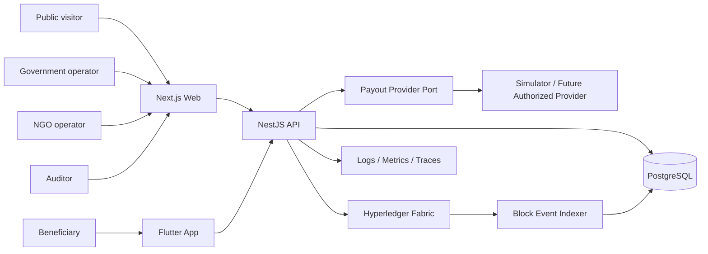
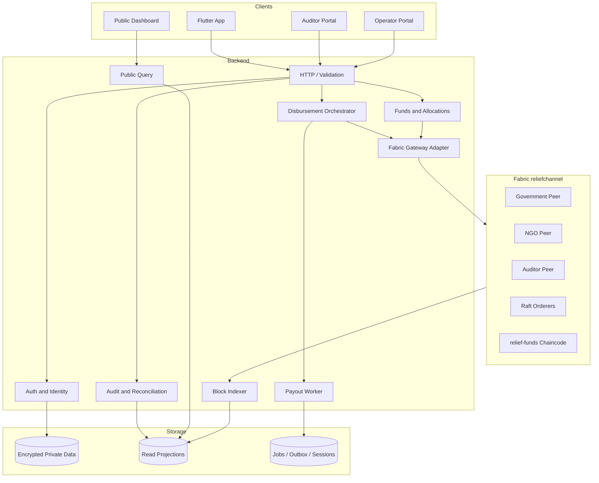
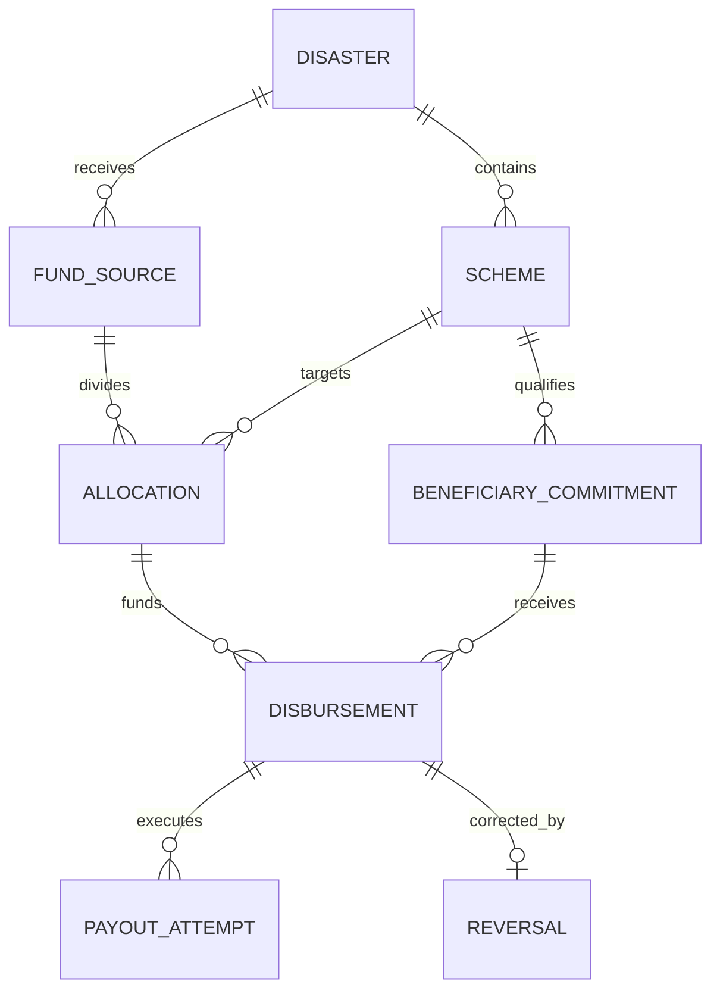
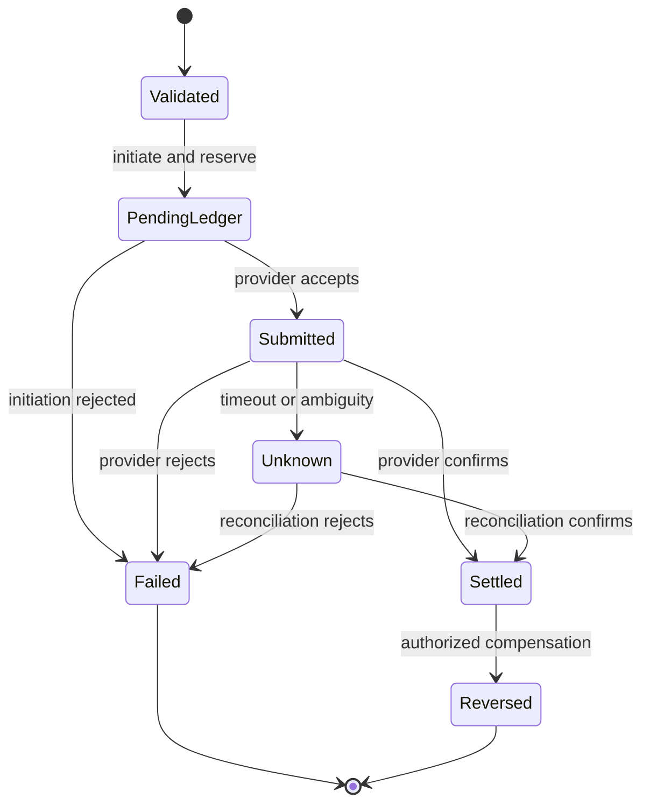
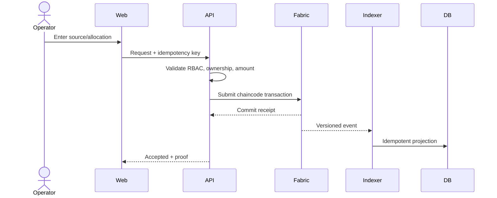
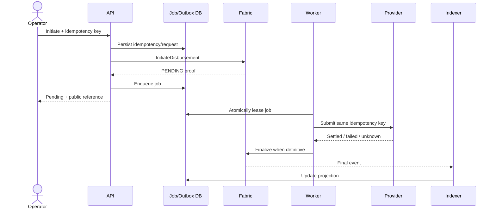
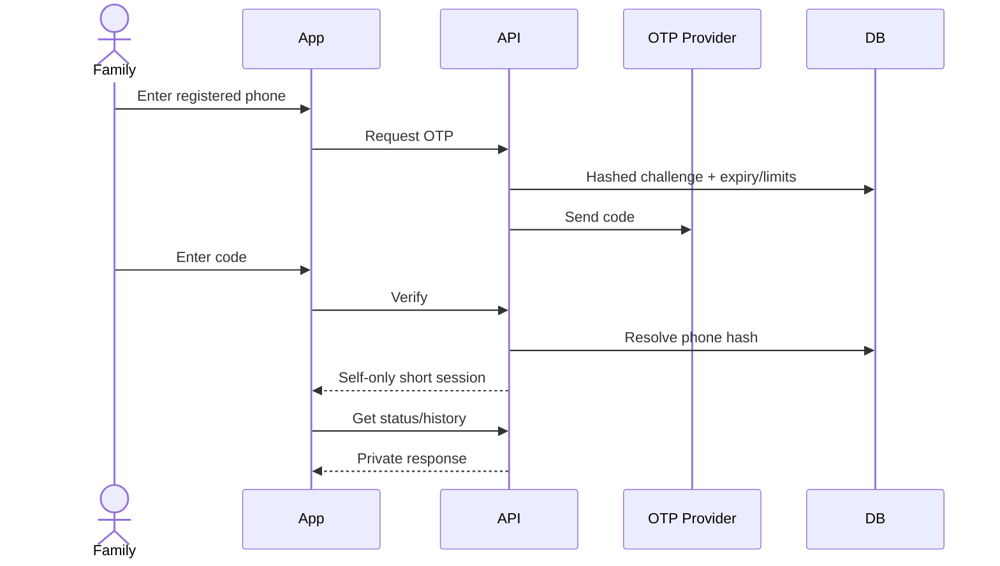
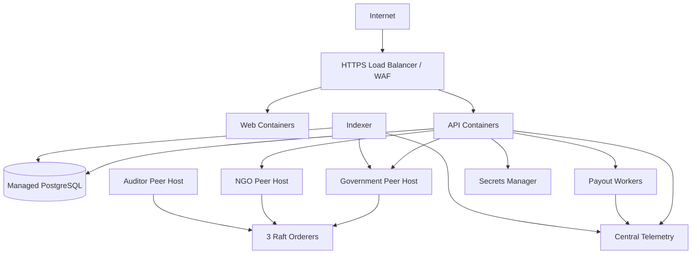

# ReliefChain Architecture and Team Boundaries

**Status:** Canonical target architecture  
**Purpose:** Define subsystem ownership, contracts, data authority, integration order, and failure behavior  
**Roadmap:** [UPGRADE_PLAN.md](UPGRADE_PLAN.md)

## 1. Principles

1. **Fabric is authoritative for financial events.** PostgreSQL is authoritative only for private data, application sessions/jobs/annotations, and rebuildable query projections.
2. **Identity remains off-chain.** Fabric receives an HMAC commitment, never Aadhaar, phone, name, OTP, or bank account.
3. **Money is integer paise.** All layers use positive integers and `INR`; floating point is forbidden for financial values.
4. **Corrections are additive.** Settled history is never edited/deleted; a correction is a linked reversal or compensating event.
5. **Authorization is layered.** Client visibility, backend RBAC, Fabric identity checks, and endorsement each enforce boundaries.
6. **External effects are idempotent.** Retries, worker restarts, timeouts, and repeated webhooks cannot create duplicate payouts.
7. **Public data is privacy-filtered.** Only safe aggregates and opaque proofs are exposed; small cohorts are suppressed.
8. **Versioned contracts enable parallel work.** OpenAPI, ledger events, state machines, and RBAC are integration boundaries.

## 2. System Context



| Actor | Goal | Boundary |
|---|---|---|
| Public visitor | Understand aggregate flow and verify an opaque receipt | Anonymous, privacy-filtered read only |
| Government operator | Manage government funds, commitments, payouts, reversals | Government organization and optional district scope |
| NGO operator | Manage NGO-owned funds and payouts | NGO organization scope |
| Beneficiary | View personal eligibility/payment status | OTP-authenticated self-only access |
| Auditor | Reconcile funds and investigate history | Authenticated read-only audit access |
| Platform operator | Deploy, monitor, rotate, and recover services | Administrative infrastructure plane |

## 3. Component Architecture



## 4. Ownership Boundaries

| Context | Responsibility | Current/target code area | Owner |
|---|---|---|---|
| Shared contracts | Vocabulary, schemas, money/reference rules | `packages/contracts` | Backend Core + cross-team review |
| Public experience | Aggregates, charts/map, proof lookup | `apps/web` public routes | Frontend Web |
| Institution experience | Government/NGO/auditor workflows | `apps/web` protected routes | Frontend Web |
| Beneficiary experience | OTP, private status, localization | `mobile` | Mobile |
| Authentication | Staff sessions, OTP, revocation, RBAC | Target `apps/api/src/auth` | Backend Core/Security |
| Identity/privacy | HMAC, encryption, retention, lookup | Target `apps/api/src/identity` | Backend Core/Security |
| Funds | Disasters, schemes, sources, allocations | Target `apps/api/src/funds` | Backend Core |
| Disbursement | Requests, batches, transitions, reversals | Target `apps/api/src/disbursements` | Backend Payments |
| Payout execution | Provider adapters, attempts, retries | Target `apps/api/src/payouts` | Backend Payments |
| Ledger adapter | Fabric submit/evaluate and receipts | Target `apps/api/src/ledger` | Backend + Blockchain |
| Chaincode | Authoritative financial state/invariants | `fabric/chaincode` | Blockchain |
| Indexer | Blocks, events, checkpoints, projections | Target `apps/api/src/indexer` | Backend + Blockchain |
| Audit | Reconciliation, evidence, exports, notes | Target `apps/api/src/audit` | Backend Core |
| Platform | Network, environments, CI/CD, telemetry | `fabric/network`, `scripts`, future `infra` | Platform |
| Quality/security | Test harness and release evidence | Cross-cutting | QA/Security |

## 5. Data Authority and Placement

| Data | System of record | Projection/replica | Public |
|---|---|---|---|
| Disaster and scheme financial registration | Fabric | PostgreSQL | Yes |
| Fund source/allocation state | Fabric | PostgreSQL | Aggregate and authorized views |
| Beneficiary HMAC commitment | Fabric | Private mapping in PostgreSQL | No |
| Name and phone | Encrypted PostgreSQL | None | No |
| Aadhaar-like input | Transient API memory only | Never stored | No |
| OTP | Hashed, expiring PostgreSQL challenge | None | No |
| Disbursement history | Fabric | PostgreSQL | Safe aggregate/opaque proof |
| Payout attempts | PostgreSQL | Settlement reference may be on Fabric | No internal details |
| Staff sessions/revocation | PostgreSQL | Optional cache | No |
| Auditor notes | PostgreSQL | None | Auditor only |
| Transaction/block proof | Fabric | PostgreSQL | Yes by opaque reference |
| API audit action | Append-only operational store | Telemetry backend | Authorized audit/security |

### Prohibited locations

- Client bundles: secrets, Fabric credentials, raw beneficiary identity.
- Fabric state/events: Aadhaar, phone, name, OTP, bank account, or encrypted PII.
- Public APIs/analytics: HMAC commitments, names, phone numbers, or small cohorts.
- Logs/traces/metrics: credentials, tokens, OTPs, PII, or identity-bearing request bodies.
- Repository: private keys, live secrets, production certificates, or real beneficiary records.

## 6. Domain Model and Invariants



Required invariants:

- `source.allocatedPaise <= source.amountPaise`.
- `allocation.disbursedPaise + allocation.reservedPaise <= allocation.amountPaise`.
- Amounts are positive safe integers in paise.
- Only an owning organization spends a source or allocation.
- An idempotency key identifies exactly one logical disbursement.
- Beneficiary scheme/district eligibility matches the allocation.
- Failure releases a reservation and does not increase disbursed balance.
- Settlement increases disbursed balance exactly once.
- Reversal links to one settlement, restores balance once, and retains original history.

### Disbursement state machine



The MVP collapses intermediate states into `PENDING`. The upgrade may expose detailed institutional states while keeping public and ledger states stable and safe.

## 7. Core Flows

### 7.1 Fund registration/allocation



### 7.2 Beneficiary commitment

1. Operator submits identity through TLS.
2. Backend normalizes and computes a versioned HMAC reference.
3. Permitted contact data is AES-256-GCM encrypted with a key version and stored in PostgreSQL.
4. Raw identity is discarded and never logged or persisted.
5. Only HMAC commitment, district, and scheme go to Fabric.
6. Safe metadata is projected; public services cannot query commitments.

### 7.3 Payout orchestration



An ambiguous submission becomes `UNKNOWN` and is reconciled by provider reference. It is never automatically resubmitted as a new payout.

### 7.4 Beneficiary OTP/status



Known and unknown phone numbers receive the same outward OTP-request response to prevent enumeration.

### 7.5 Projection replay

- Subscribe to committed peer block events.
- Uniquely identify events by channel, block, transaction, and event index.
- Apply event and advance checkpoint in one PostgreSQL transaction.
- Make reprocessing a no-op.
- Resume from durable checkpoint after restart.
- Rebuild into empty projection tables and compare calculated totals with ledger state before cutover.

## 8. API Contract

The backend owns `/api/v1`; checked-in OpenAPI generates web/mobile clients and QA mocks.

| Group | Auth | Purpose |
|---|---|---|
| `/public/*` | None | Safe summaries, breakdowns, proofs |
| `/auth/login` | None + rate limit | Staff authentication |
| `/auth/otp/*` | None + strict rate limit | Beneficiary challenge/verification |
| `/operator/*` | Government/NGO | Funds, commitments, batches, payouts, reversals |
| `/beneficiary/me/*` | Self-only beneficiary | Eligibility, status, history, proof |
| `/audit/*` | Auditor | Events, reconciliation, exceptions, exports, notes |
| `/health/live` | Infrastructure | Process liveness |
| `/health/ready` | Infrastructure | DB, migration, Fabric, queue, indexer readiness |

Standard error envelope:

```json
{
  "code": "ALLOCATION_BALANCE_EXCEEDED",
  "message": "The requested amount exceeds the available allocation balance.",
  "correlationId": "opaque-request-id",
  "details": [{ "field": "amountPaise", "code": "OUT_OF_RANGE" }]
}
```

Errors do not expose PII, secrets, peer internals, SQL, or stack traces.

## 9. Ledger Contract

Versioned event envelope:

```json
{
  "schemaVersion": 1,
  "eventType": "DisbursementSettled",
  "entityType": "disbursement",
  "entityId": "uuid",
  "occurredAt": "transaction-context timestamp",
  "payload": {
    "publicReference": "opaque reference",
    "allocationId": "uuid",
    "amountPaise": 2500000,
    "status": "SETTLED",
    "settlementReference": "non-sensitive reference"
  }
}
```

Broadly distributed event payloads exclude beneficiary commitments. Internal links, where required, stay in protected state and authorized queries.

### Organizations

| Organization | Purpose | Write capability |
|---|---|---|
| GovernmentMSP | Government financial ledger | Government-owned assets |
| NgoMSP | NGO financial ledger | NGO-owned assets |
| AuditorMSP | Independent synchronized verification | No application financial mutation |
| OrdererMSP | Raft/orderer administration | Channel ordering/configuration |

CA-managed roles/attributes are verified by chaincode; MSP membership alone does not grant every function.

## 10. Security Boundaries

1. Internet to edge: TLS, request limits, WAF/rate controls, headers.
2. Client to API: untrusted input; validate shape, size, authorization, and rate.
3. API to PostgreSQL: private network, least privilege, encrypted fields.
4. API to Fabric: mutual TLS and organization-specific gateway identity.
5. Worker to provider: authenticated idempotent requests and verified webhooks.
6. Operations plane: separate deployment, secret, backup, and Fabric admin access.

Required controls include CSP/CORS, short sessions and revocation, MFA for privileged pilot users, versioned encryption/HMAC keys, PII-safe telemetry, Fabric CA/TLS rotation, webhook replay protection, encrypted backups, and audited restore tests.

## 11. Deployment

### Local

- `npm run demo:api` plus `npm run dev:web` for frontend-only work.
- Docker Compose for API, PostgreSQL, and three-organization Fabric integration.
- Synthetic fixtures only.

### Staging/pilot target



Web, API, workers, and indexer are independently deployable/scalable. Fabric peers/orderers use persistent storage, stable identity, backup, and governance separate from stateless applications.

## 12. Target Repository Layout

```text
apps/
  web/                 Next.js user interfaces
  api/                 NestJS HTTP application
  worker/              Payout worker entry point
  indexer/             Fabric block-event consumer
  demo-api/            Frontend-only in-memory adapter
mobile/                Flutter beneficiary application
packages/
  contracts/           Domain and validation schemas
  api-client-web/      Generated TypeScript client
  api-client-dart/     Dart generation configuration/output
  ui/                  Shared web design system
fabric/
  chaincode/           Versioned chaincode and tests
  network/             Local/staging topology
infra/
  environments/        CI, staging, pilot configuration
  monitoring/          Dashboards and alerts
scripts/               Bootstrap, migration, smoke, recovery
docs/
  decisions/           Architecture decision records
  runbooks/            Operational procedures
```

Create a target directory only when that component becomes independently deployable or reusable.

## 13. Team Integration Rules

- Web/mobile use generated clients and do not duplicate API types.
- Backend owns OpenAPI; blockchain owns chaincode/event schemas; domain changes receive cross-team review.
- Backend depends on a ledger port and fixtures, not chaincode implementation classes.
- Chaincode never calls external services or uses non-deterministic time/randomness.
- Only the indexer advances projection checkpoints.
- Public services read safe projections, not beneficiary tables or unrestricted world state.
- Demo API responses conform to the same OpenAPI fixtures as the real API.
- Platform preserves agreed ports, health, secret, image, and persistence contracts.
- Cross-team features start with fixtures and finish with a joint E2E test.

## 14. Failure Behavior

| Failure | Expected behavior |
|---|---|
| API unavailable | Clients show retry guidance and never claim success |
| Fabric unavailable before submit | Reject/queue per use case; do not write confirmed projection |
| Fabric commits but response is lost | Same idempotency key returns committed transaction |
| Projection DB unavailable | Ledger continues; indexer replays later; public freshness shows lag |
| Worker crashes after submit | Lease expires; next worker reconciles before acting |
| Peer unavailable | Gateway uses another authorized peer and alerts |
| Orderer quorum unavailable | Writes stop; synchronized peer reads remain available |
| OTP provider unavailable | Generic retry; no bypass outside local demo |
| Certificate nearing expiry | Alert and rotate within overlap window |
| Key exposure suspected | Revoke/rotate, stop writers, retain evidence, reconcile |

## 15. Required Architecture Decisions

Create ADRs before implementing:

1. OpenAPI source and client generator.
2. Database migration/ORM approach.
3. Queue and leasing implementation.
4. Endorsement by transaction type.
5. CA attributes and certificate rotation.
6. Event envelope and replay strategy.
7. Secrets manager and key versioning.
8. Web query state and design system.
9. Flutter state/localization approach.
10. Pilot compute, backup, and recovery targets.

## 16. Ownership Handoff Checklist

Every handoff includes:

- Versioned schema/interface.
- Success, validation, authorization, conflict, and failure fixtures.
- Unit and integration tests.
- Security/privacy impact statement.
- Metrics, logs, health behavior, and alert owner.
- Migration and compatibility notes.
- Local run instructions.
- Deployment and rollback procedure.
- Named receiving owner and acceptance confirmation.
