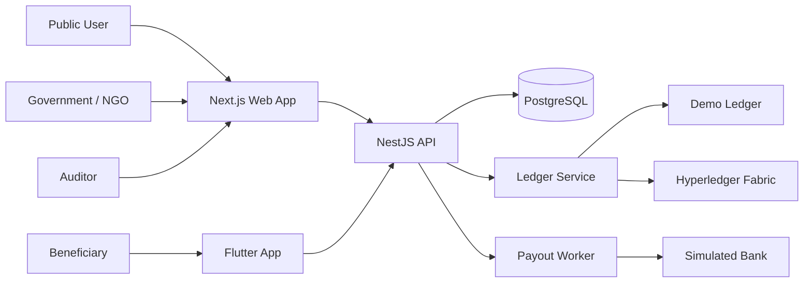
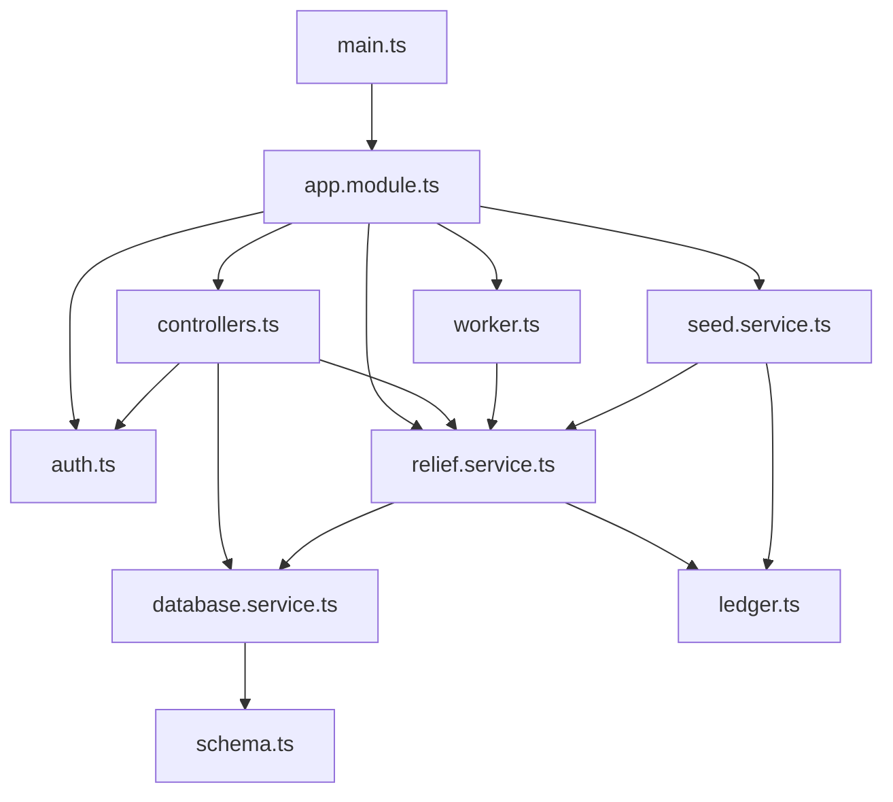
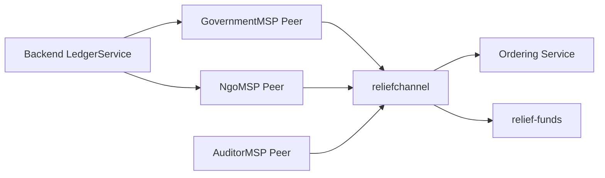
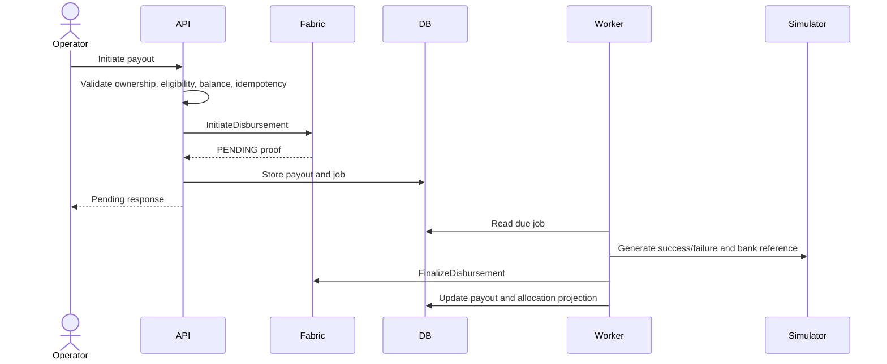

# ReliefChain Architecture

This document explains how ReliefChain is structured **right now**. It is intentionally simple so frontend, backend, and blockchain work can be divided without requiring every developer to understand the entire system.

For the longer upgrade roadmap, see [UPGRADE_PLAN.md](UPGRADE_PLAN.md).

## 1. System Overview



ReliefChain has four main parts:

| Part | Technology | Responsibility |
|---|---|---|
| Web frontend | Next.js | Public dashboard, operator portal, auditor portal |
| Mobile frontend | Flutter | Beneficiary OTP login and payment status |
| Backend | NestJS and PostgreSQL | Authentication, business workflows, privacy, jobs, queries |
| Blockchain | Hyperledger Fabric | Immutable financial events and balance rules |

There is also a small zero-Docker demo API in `apps/demo-api`. It imitates the backend for local frontend demonstrations but is not the real backend.

## 2. Current Repository Structure

```text
apps/
  web/                     Next.js frontend
  api/                     Real NestJS backend
  demo-api/                In-memory local demonstration API
mobile/                    Flutter beneficiary application
packages/
  contracts/               Shared validation, types, privacy helpers
fabric/
  chaincode/               Fabric smart-contract code
  network/                 Fabric organizations and network configuration
scripts/                   Fabric startup, deployment, and smoke tests
```

## 3. Current Backend Structure

The real backend is one NestJS application under `apps/api`. It is not currently split into many NestJS feature modules.



### Backend file responsibilities

| File | Current responsibility | Safe owner |
|---|---|---|
| `main.ts` | Starts NestJS, configures CORS, global prefix, validation, and Swagger | Backend lead/platform |
| `app.module.ts` | Registers controllers, services, JWT, worker, and seed service | Backend lead |
| `config.ts` | Validates required environment variables and secret formats | Backend security |
| `controllers.ts` | Contains public, operator, beneficiary, auditor, and health routes | Backend API developer |
| `auth.ts` | Staff login, OTP request/verification, JWT guard, role decorator | Backend auth developer |
| `relief.service.ts` | Main business logic for funds, allocations, beneficiaries, payouts, settlement, and reversal | Backend domain developer |
| `ledger.ts` | Chooses memory or Fabric mode and submits/evaluates transactions | Backend/blockchain integration developer |
| `database.service.ts` | PostgreSQL pool, queries, and transaction helper | Backend data developer |
| `schema.ts` | Current PostgreSQL table definitions | Backend data developer |
| `worker.ts` | Polls payout jobs and finalizes simulated payouts | Backend payments developer |
| `seed.service.ts` | Creates demo accounts and Assam flood records | Backend/demo developer |
| `seed.ts` | Command-line entry point for seeding | Backend/demo developer |

### Important backend rule

`relief.service.ts` is currently the central coordinator. It talks to both PostgreSQL and the ledger. Two developers should not make large changes to this file at the same time without first dividing it by use case.

## 4. Backend Request Flow

Every request follows this simple path:

```text
Browser or mobile app
        ↓
NestJS controller
        ↓
JWT role and organization check
        ↓
ReliefService business validation
        ↓
LedgerService transaction submission
        ↓
PostgreSQL projection/private-data update
        ↓
JSON response containing a ledger proof
```

The controller should only receive and validate HTTP data. Financial rules belong in the service and chaincode, not in the frontend.

## 5. Backend API Groups

All real backend routes use the `/api/v1` prefix.

| Route group | User | Purpose |
|---|---|---|
| `/public/*` | Anyone | Dashboard totals, district aggregates, proof lookup |
| `/auth/login` | Staff | Government, NGO, and auditor login |
| `/auth/otp/*` | Beneficiary | Request and verify mock OTP |
| `/operator/*` | Government or NGO | Funds, allocations, beneficiaries, payouts, reversals |
| `/beneficiary/me` | Beneficiary | Private eligibility and payment history |
| `/audit/*` | Auditor | Ledger events, reconciliation, CSV export |
| `/health` | Platform | Database/API health and active ledger mode |
| `/docs` | Developers | Swagger documentation under `/api/v1/docs` |

### Role rules

| Role | Allowed operations |
|---|---|
| `GOVERNMENT` | Operate government-owned fund sources and allocations |
| `NGO` | Operate NGO-owned fund sources and allocations |
| `AUDITOR` | Read audit events, reconciliation, and exports |
| `BENEFICIARY` | Read only the authenticated beneficiary’s record |

The backend also checks `orgMsp`. A Government user must not spend an NGO allocation, and an NGO user must not spend a Government allocation.

## 6. Data Storage

### PostgreSQL stores

- Staff accounts and password hashes.
- Encrypted beneficiary name and phone.
- Phone lookup hash.
- Hashed OTP challenges and expiry.
- Disasters, schemes, sources, allocations, and disbursement projections.
- Pending payout jobs and attempts.
- Indexed ledger events and checkpoint metadata.

### Fabric stores

- Disaster and scheme registration.
- Fund source creation.
- District/scheme allocation.
- HMAC beneficiary commitment.
- Disbursement initiation.
- Settlement or failure.
- Reversal.

### Never store on Fabric

- Aadhaar number.
- Phone number.
- Beneficiary name.
- OTP.
- Bank-account data.
- Encryption keys or JWT secrets.

## 7. Privacy Flow

When an operator registers a beneficiary:

1. The backend validates the synthetic Aadhaar-like value and phone.
2. It creates an HMAC-SHA-256 beneficiary reference using a server secret.
3. It encrypts the name and phone with AES-256-GCM.
4. It stores only encrypted contact data and hashes in PostgreSQL.
5. It submits only the HMAC reference, district, and scheme to Fabric.
6. It discards the raw Aadhaar-like value without storing it.

The public dashboard queries aggregate projections. It does not query beneficiary private data.

## 8. Ledger Modes

`LedgerService` supports two modes selected by `LEDGER_MODE`.

### Memory mode

```text
LEDGER_MODE=memory
```

- Generates development transaction IDs.
- Records safe ledger-event projections in PostgreSQL.
- Does not use Hyperledger Fabric.
- Useful for API development when Docker is unavailable.

### Fabric mode

```text
LEDGER_MODE=fabric
```

- Connects to Fabric using organization-specific gateway certificates.
- Uses the Government identity for government-owned operations.
- Uses the NGO identity for NGO-owned operations.
- Submits chaincode transactions and waits for commit status.
- Returns the Fabric transaction ID and block metadata.

The public UI must eventually show the active ledger mode clearly. Demo or memory receipts must never be presented as real Fabric proofs.

## 9. Blockchain Structure

The Fabric network uses one channel named `reliefchannel` and one chaincode package named `relief-funds`.



| Organization | Current purpose |
|---|---|
| `GovernmentMSP` | Writes government funds, allocations, and payouts |
| `NgoMSP` | Writes NGO funds, allocations, and payouts |
| `AuditorMSP` | Maintains an independent ledger copy for verification |
| `OrdererMSP` | Orders channel transactions |

Chaincode owns the most important financial rules:

- Positive integer amounts only.
- No source over-allocation.
- No allocation over-disbursement.
- No duplicate idempotency key.
- Only the owning organization may spend or reverse.
- Only pending payouts may become settled or failed.
- Only settled payouts may be reversed.

## 10. Payout Flow

Payouts are simulated; no money moves.



The job worker polls PostgreSQL every second. It retries failures up to five times. This is suitable for the MVP but should later use atomic job leasing and dead-letter handling.

## 11. Demo API Versus Real Backend

| Feature | `apps/demo-api` | `apps/api` |
|---|---|---|
| Purpose | Frontend demonstration | Real application backend |
| Database | In-memory JavaScript objects | PostgreSQL |
| Ledger | Fake development proofs | Memory adapter or Fabric |
| Persistence | Lost on restart | Persistent |
| Authentication | In-memory demo tokens | JWT and Argon2 |
| Privacy encryption | Not applicable to synthetic in-memory UI fixtures | AES-256-GCM and HMAC |
| Swagger | No | Yes |
| Use in pilot | Never | Yes, after upgrades |

Frontend developers can use `demo-api`. Backend, blockchain, integration, and security testing must use `apps/api`.

## 12. Simple Work Division

### Frontend team

Owns:

- `apps/web`
- `mobile`
- Design, responsive layouts, accessibility, localization, and client-side states

Depends on:

- API request/response types
- Role matrix
- Stable status names and error codes

Must not change:

- Financial rules
- Organization ownership logic
- Ledger proof meaning

### Backend API/auth team

Owns:

- `controllers.ts`
- `auth.ts`
- `main.ts`
- API documentation and validation

First refactor target:

- Separate public, operator, beneficiary, audit, and auth controllers into folders without changing behavior.

### Backend domain/data team

Owns:

- `relief.service.ts`
- `database.service.ts`
- `schema.ts`
- `worker.ts`
- `seed.service.ts`

First refactor target:

- Split `ReliefService` into funds, beneficiaries, disbursements, and payout services.
- Replace startup SQL with migrations.
- Preserve the current public API during refactoring.

### Blockchain team

Owns:

- `fabric/chaincode`
- `fabric/network`
- Fabric lifecycle scripts

Works jointly with backend on:

- `ledger.ts`
- Transaction arguments and responses
- Ledger event payloads
- Organization identities and endorsement

### QA/security team

Owns cross-system tests for:

- Cross-organization access denial.
- Duplicate payouts.
- Balance invariants.
- Projection versus ledger reconciliation.
- PII absence from Fabric, public APIs, logs, and exports.

## 13. Recommended Backend Refactor Order

Do not rewrite the backend at once. Use these steps:

### Step 1 — Freeze behavior

- Export the current Swagger/OpenAPI document.
- Add integration tests for login, fund creation, allocation, beneficiary commitment, payout, settlement, reversal, proof, and audit export.
- Record current database fixtures and chaincode transaction fixtures.

### Step 2 — Split controllers

Move routes from `controllers.ts` into:

```text
controllers/
  public.controller.ts
  operator.controller.ts
  beneficiary.controller.ts
  audit.controller.ts
  health.controller.ts
```

No request or response shape should change in this step.

### Step 3 — Split authentication

Move `auth.ts` into:

```text
auth/
  auth.controller.ts
  auth.service.ts
  jwt.guard.ts
  roles.decorator.ts
  auth.types.ts
```

Keep the current JWT and OTP behavior until tests pass, then add refresh sessions and stronger rate limits.

### Step 4 — Split ReliefService

Create:

```text
funds/funds.service.ts
beneficiaries/beneficiaries.service.ts
disbursements/disbursements.service.ts
payouts/payout.service.ts
ledger/ledger.service.ts
```

Move one use case at a time and keep chaincode calls behind `LedgerService`.

### Step 5 — Add migrations

- Introduce a migration tool.
- Create a baseline migration matching `schema.ts`.
- Test empty database creation and upgrade from an MVP snapshot.
- Stop executing schema creation on every application startup.

### Step 6 — Upgrade payout jobs

- Add atomic job leasing.
- Add payout attempt history.
- Add exponential retry and dead-letter state.
- Add `UNKNOWN` for ambiguous provider timeouts.
- Never retry as a new logical payout.

### Step 7 — Add a real Fabric indexer

- Subscribe to committed block events.
- Save a durable checkpoint.
- Make event processing idempotent.
- Rebuild projections from the ledger.
- Show projection lag in health and public freshness metadata.

## 14. Interfaces Teams Must Agree On

Before parallel implementation, freeze:

1. API request and response types.
2. Error format and error codes.
3. Role and organization permissions.
4. Disbursement state names and transitions.
5. Chaincode function arguments and return values.
6. Ledger event names and privacy-safe payloads.
7. Money representation in integer paise.
8. Public proof shape.
9. Environment variable names.
10. Test fixture IDs and expected balances.

## 15. Current Limitations

- The full backend requires PostgreSQL; it does not currently fall back to an in-memory database.
- The local demo API is separate and can drift unless contract tests are added.
- `ReliefService` and `controllers.ts` are too large for safe parallel editing.
- Database schema changes are not versioned migrations.
- Ledger projection records API-submitted receipts rather than replaying peer block events.
- Payout jobs do not use atomic multi-worker leasing.
- Fabric is configured for a single-host hackathon topology.
- Application identities are generated for the demo rather than fully managed through Fabric CA lifecycle.
- Real Docker/Fabric and Flutter device execution have not been verified on the current workstation because the required local tools are unavailable.

## 16. Definition of Done for Architecture Work

The system is ready for parallel upgrade work when:

- Current API behavior has integration tests.
- OpenAPI is checked into source control.
- Roles and organization permissions are documented and tested.
- Chaincode transaction/event fixtures are shared by backend and blockchain tests.
- Controller and service ownership is assigned.
- Each team has a local run mode that uses the same API contract.
- Breaking interface changes require review from all affected teams.
