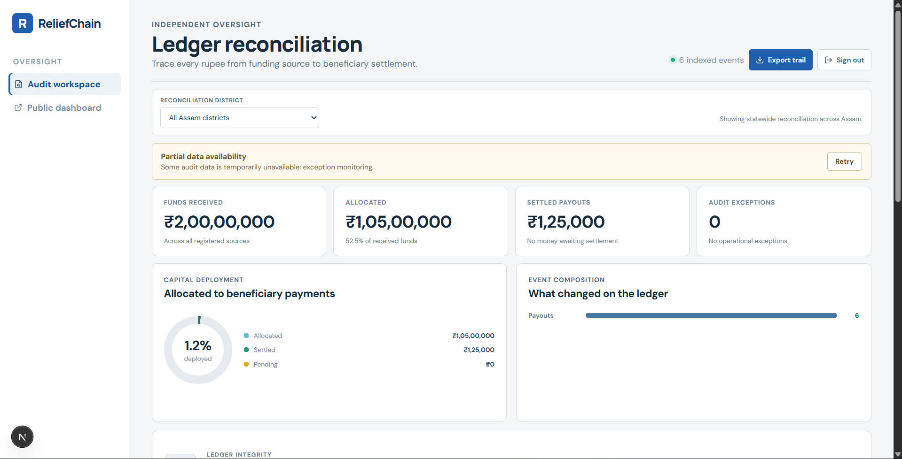
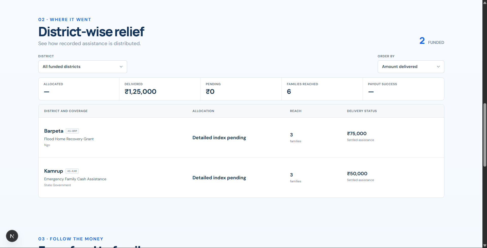
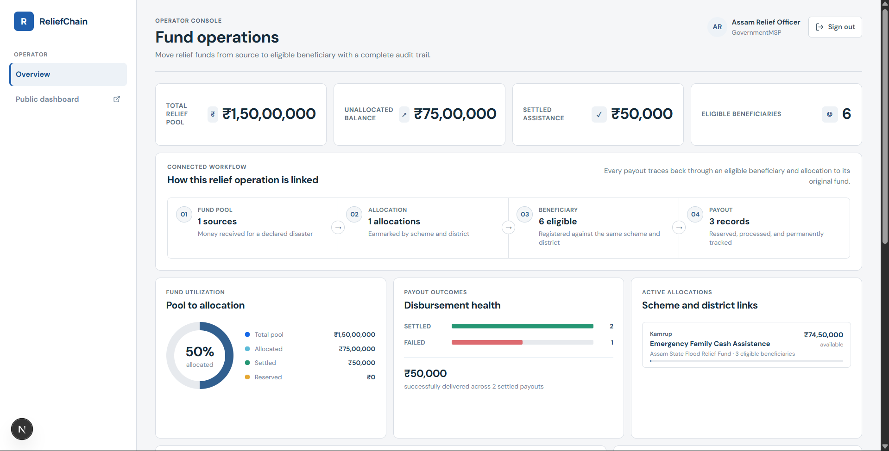
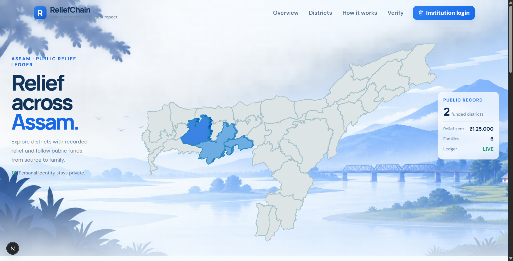
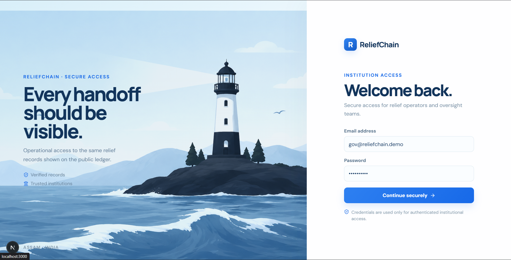

# ReliefChain

ReliefChain is a blockchain-verified disaster-relief tracking MVP. It follows synthetic Assam flood funds from government and NGO sources through allocations and simulated beneficiary settlements, while keeping Aadhaar-like identifiers and contact details off the public ledger.

> **Start here:** Read [How to Use and Operate ReliefChain](HOW_TO_USE.md) for local startup, login credentials, role-by-role workflows, and `Failed to fetch` troubleshooting.

Planning documents:

- [Architecture and team boundaries](ARCHITECTURE.md)
- [Why the evidence model reduces blind trust](TRUST_AND_VERIFICATION_NOTE.md)
- [Frontend, backend, and blockchain upgrade plan](UPGRADE_PLAN.md)
- [Work for non-backend teams](OTHER_TEAMS_WORK.md)

## Screenshots

| Auditor Dashboard | District-Wise Relief | Operator Dashboard |
|------------------|----------|-------------|
|  |  |  |

|Public Dashboard | Login |
|----------|----------------|
|  |  |

## Fastest local demo

Docker is not required for the UI demonstration. Run these commands in two separate terminals:

```powershell
npm run demo:api
```

```powershell
npm run dev:web
```

Then open [http://localhost:3000](http://localhost:3000). Both processes must remain running; starting only the web application causes login to report `Failed to fetch`.

## What is included

- A Next.js public dashboard plus operator and auditor portals.
- A NestJS API with short-lived JWT/RBAC, rotating refresh sessions, rate-limited mock OTP, encrypted beneficiary data, audit CSV, OpenAPI, durable payout jobs, and PostgreSQL projections.
- Hyperledger Fabric Node chaincode with Government, NGO, and Auditor organizations.
- A bilingual Flutter beneficiary client with status read-aloud and offline cache.
- Docker Compose packaging for a single Ubuntu VM, Caddy HTTPS, health checks, demo seeding, and Fabric lifecycle scripts.

## Quick start without Fabric

Docker is the easiest way to run the complete web/API demo. Copy `.env.example` to `.env` and replace all secrets. Generate a PII key with `openssl rand -base64 32`; use independent random values of at least 32 characters for JWT and HMAC secrets.

```bash
docker compose up --build -d
node scripts/smoke-test.mjs
```

Open `http://localhost`. This default uses `LEDGER_MODE=memory` and labels receipts accordingly; it is intended only for development.

Demo credentials after automatic seeding:

| Experience | Identity | Secret |
|---|---|---|
| Government operator | `gov@reliefchain.demo` | `Relief@123` |
| NGO operator | `ngo@reliefchain.demo` | `Relief@123` |
| Auditor | `auditor@reliefchain.demo` | `Relief@123` |
| Beneficiary | Value from `DEMO_BENEFICIARY_PHONE` | Value from `MOCK_OTP` |

All records and monetary values are synthetic.

## Real Fabric demo

Install Docker with the Compose plugin, Node 20+, npm, and Bash/WSL on the Ubuntu VM or development machine. Then:

```bash
npm install
bash scripts/fabric-up.sh
bash scripts/deploy-chaincode.sh
LEDGER_MODE=fabric docker compose up --build -d
node scripts/smoke-test.mjs
```

The setup creates `reliefchannel`, one peer for each organization, an ordering node, three enrollment-ready CAs, and deploys `relief-funds` chaincode. Generated MSP material is ignored by Git. Never run the Fabric demo with committed or shared private keys.

## Flutter beneficiary app

Git and the Android SDK are required by Flutter tooling. From `mobile/`, generate platform wrappers once if they are absent, fetch packages, and build with the deployed API URL:

```bash
flutter create --platforms android .
flutter pub get
flutter test
flutter build apk --release --dart-define=API_URL=https://your-domain.example/api/v1
```

The APK will be written under `mobile/build/app/outputs/flutter-apk/`. The current machine has Flutter but not Git or an Android project wrapper, so the repository includes the complete Dart application and test while platform generation remains an environment prerequisite.

## Local development and verification

```bash
npm install
npm run build
npm test
npm run typecheck
```

API documentation is served at `/api/v1/docs`. Backend workflow details are in [BACKEND_WORKFLOW.md](BACKEND_WORKFLOW.md); see the [architecture](ARCHITECTURE.md), [trust and verification note](TRUST_AND_VERIFICATION_NOTE.md), and [security boundaries](docs/SECURITY.md) before presenting or extending the MVP.

## Cloud VM deployment

1. Point a DNS A record at an Ubuntu VM with ports 80 and 443 open.
2. Install Docker Engine, Compose, Node/npm, and Git.
3. Clone the repository and create `.env` with strong secrets, `DOMAIN`, `POSTGRES_PASSWORD`, `AUTO_SEED=true`, and `LEDGER_MODE=fabric`.
4. Run the Fabric setup and chaincode deployment commands above, followed by `docker compose up --build -d`.
5. Run the smoke test against `RELIEFCHAIN_URL=https://your-domain.example` and install the release APK on the demo Android device.

This topology is purpose-built for a hackathon and must not be described as production-ready.
