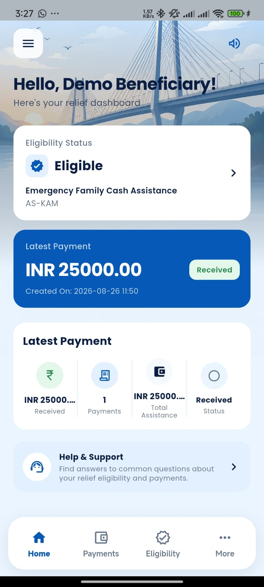
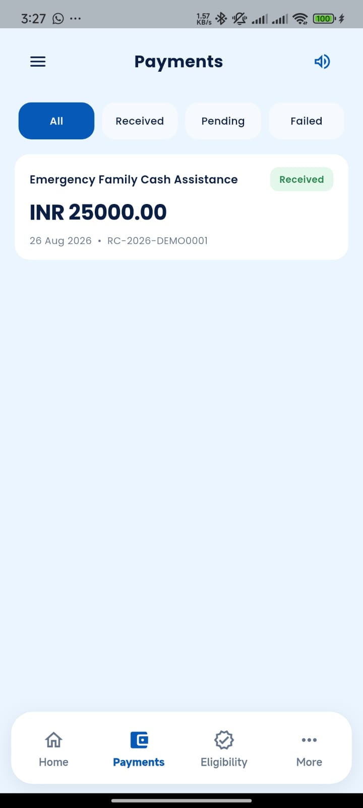
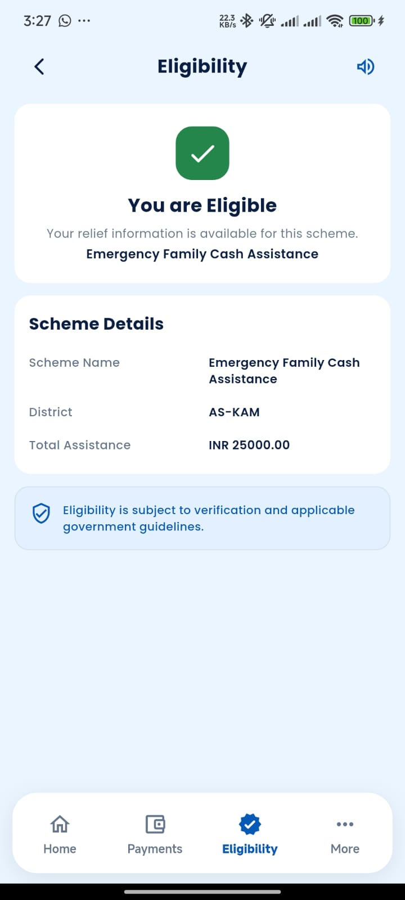
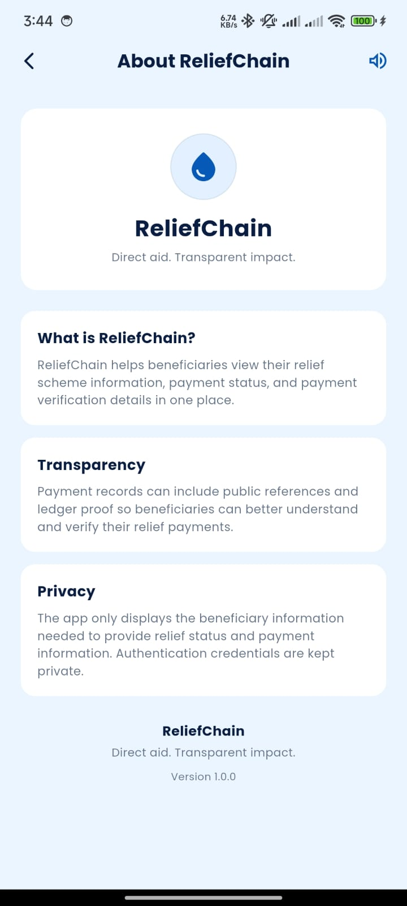
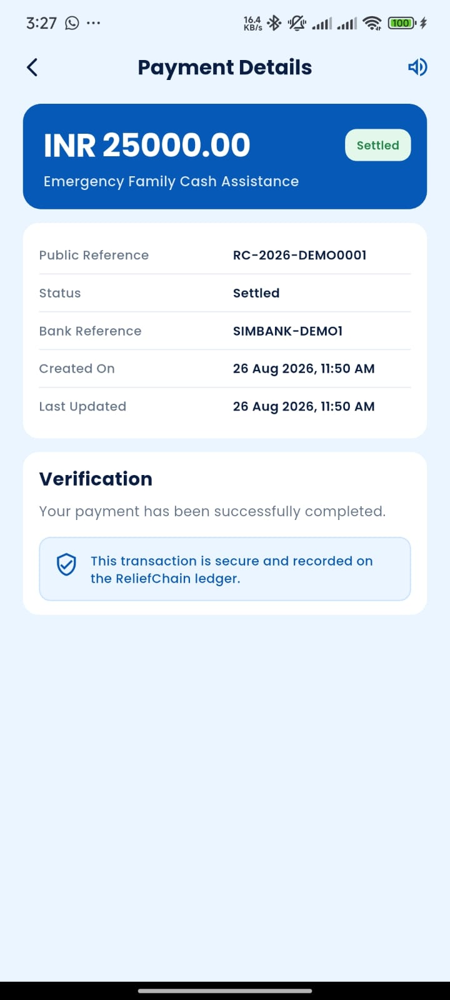
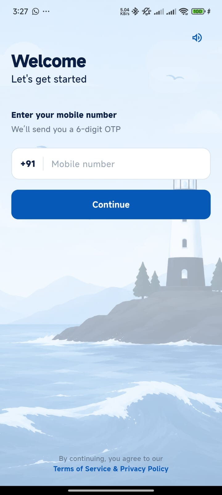
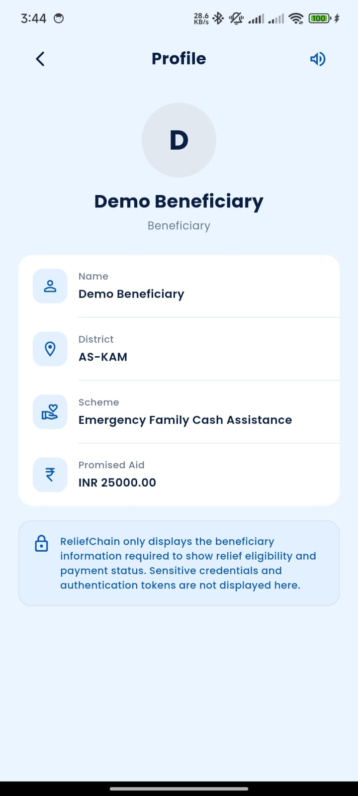
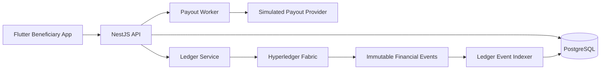
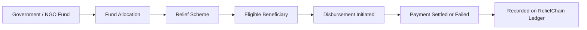

# ReliefChain

> Direct aid. Transparent impact.

ReliefChain is a blockchain-verified disaster relief platform that helps beneficiaries securely access relief information, check scheme eligibility, and track assistance payments.

i hate my team

## Features

### Beneficiary Authentication

* Mobile number login
* Six-digit OTP verification
* Secure beneficiary access
* Persistent sessions
* Token-based authentication

### Eligibility Tracking

Beneficiaries can view:

* Eligibility status
* Applicable relief scheme
* District information
* Total assistance amount
* Verification and government guideline notices

### Payment Tracking

Beneficiaries can browse their relief payment history and track the current status of each payment.

Available payment states include:

* Received
* Pending
* Failed
* Settled
* Reversed

Payments can also be filtered by status.

### Payment Details

Each payment includes:

* Assistance amount
* Relief scheme
* Public reference
* Payment status
* Bank/provider reference
* Creation time
* Last updated time

### Transaction Verification

Completed payments can be verified through the ReliefChain ledger.

The ledger stores privacy-safe financial events so transactions can be traced and audited without exposing sensitive beneficiary information.

### Accessibility

* Text-to-Speech
* Hindi Text-to-Speech
* Larger text mode
* Clear visual hierarchy
* Simple navigation
* Readable status indicators

### Localization

The mobile application currently supports:

* English
* Hindi

The selected language is persisted locally and applies across the application.

### Offline Support

The beneficiary application uses Hive to cache previously retrieved beneficiary information.

If connectivity is unavailable, cached information can still be viewed while fresh data can be retrieved when the network becomes available again.

## Mobile Application

The beneficiary application is built with Flutter and communicates with the ReliefChain backend through REST APIs.

The primary navigation includes:

* Home
* Payments
* Eligibility
* More

## Screenshots

| Dashboard | Payments | Eligibility | About |
|-----------|----------|-------------|-------|
|  |  |  |  |

| Splash | Payment Details | Login | Profile |
|----------|----------------|----------|--|
|  |  |  |  |

## System Architecture



The mobile application does not communicate directly with the blockchain network.

All operations go through the backend API, which handles authentication, authorization, business rules, database operations, privacy boundaries, and ledger interactions.

## Technology Stack

| Layer | Technology |
|------|------------|
| Mobile Application | Flutter, Dart |
| Backend | NestJS |
| Database | PostgreSQL |
| Blockchain | Hyperledger Fabric |
| Authentication | JWT + OTP |
| Local Cache | Hive |
| API Documentation | OpenAPI / Swagger |
| Infrastructure | Docker Compose, Caddy |

## Blockchain and Transparency

ReliefChain uses Hyperledger Fabric to create an immutable record of important financial transitions.

The ledger workflow supports:

1. Registering a disaster
2. Registering a relief scheme
3. Creating a fund source
4. Allocating funds
5. Registering beneficiary commitments
6. Initiating a disbursement
7. Finalizing a disbursement
8. Reversing a disbursement

A simplified flow looks like:



The ledger stores privacy-safe transaction information and immutable financial state.

Sensitive information such as beneficiary names, phone numbers, OTPs, bank references, secrets, and identity numbers is intentionally excluded from public ledger events.

## Privacy Model

ReliefChain separates private beneficiary information from public financial verification.

The system uses:

* HMAC-based beneficiary references
* AES-256-GCM encrypted contact data
* Privacy-safe ledger events
* Hashed provider references
* JWT-based authenticated access
* Role-based authorization

The public verification flow exposes only the information required to verify a disbursement without revealing beneficiary identity.

## Repository Structure

```text
ReliefChain/
│
├── apps/
│   └── api/                    # NestJS backend
│
├── mobile/
│   └── reliefchain/            # Flutter beneficiary application
│
├── packages/
│   └── contracts/              # Shared contracts and ledger schemas
│
├── fabric/
│   ├── chaincode/              # Hyperledger Fabric chaincode
│   └── network/                # Fabric network configuration
│
├── scripts/
│   ├── fabric-up.sh
│   ├── deploy-chaincode.sh
│   └── smoke-test.mjs
│
├── docs/
│   └── SECURITY.md
│
├── ARCHITECTURE.md
├── BACKEND_CONTRACTS.md
├── BACKEND_WORKFLOW.md
├── HOW_TO_USE.md
└── compose.yaml
```

## Getting Started

### Prerequisites

Depending on which part of the project you want to run, you may need:

* Node.js 20+
* npm
* Flutter
* Dart
* Android SDK
* Docker and Docker Compose
* Git

### Run the Flutter Application

Navigate to the Flutter project:

```bash
cd mobile/reliefchain
```

Install dependencies:

```bash
flutter pub get
```

Generate localization files:

```bash
flutter gen-l10n
```

Generate JSON serialization files:

```bash
dart run build_runner build --delete-conflicting-outputs
```

Run the application:

```bash
flutter run
```

For an Android emulator, the API address should typically use:

```text
http://10.0.2.2:4000/api/v1
```

For a physical device, configure the application to use the LAN address of the machine running the API.

## Run the Local Backend

Start the development API:

```bash
npm run start:dev
```

The API is available under:

```text
http://localhost:4000/api/v1
```

## Build a Release APK

Build the Flutter application with the deployed API URL:

```bash
flutter build apk --release \
  --dart-define=API_URL=https://your-domain.example/api/v1
```

The generated APK will be available under:

```text
build/app/outputs/flutter-apk/
```

## Full Stack Demo

Copy the environment template:

```bash
cp .env.example .env
```

Configure the required environment variables and secrets, then run:

```bash
docker compose up --build -d
```

Run the smoke test:

```bash
node scripts/smoke-test.mjs
```

The development setup can use an in-memory ledger adapter, while Hyperledger Fabric can be enabled separately for the blockchain demonstration.

## Hyperledger Fabric Demo

Start the Fabric network:

```bash
npm install
bash scripts/fabric-up.sh
```

Deploy the ReliefChain chaincode:

```bash
bash scripts/deploy-chaincode.sh
```

Start the application using Fabric:

```bash
LEDGER_MODE=fabric docker compose up --build -d
```

Then run:

```bash
node scripts/smoke-test.mjs
```

The Fabric network includes Government, NGO, and Auditor organizations connected through the `reliefchannel`.

## API

The backend exposes its API under:

```text
/api/v1
```

When running the full NestJS backend, API documentation is available at:

```text
/api/v1/docs
```

## Project Scope

ReliefChain is a hackathon MVP designed to demonstrate a transparent and privacy-conscious disaster relief workflow.

The project currently uses:

* Synthetic beneficiary identities
* Simulated OTP delivery
* Simulated payout processing
* Demo fund sources
* Demo relief schemes
* Simulated payment providers

No real money, bank accounts, Aadhaar records, UIDAI services, or production notification providers are used.

## Project Status

ReliefChain currently includes:

* Flutter beneficiary application
* NestJS backend
* PostgreSQL database
* Hyperledger Fabric integration
* OTP authentication
* Eligibility tracking
* Payment tracking
* Payment details
* Payment verification
* English/Hindi localization
* Text-to-Speech
* Larger text accessibility
* Hive caching
* Offline-friendly cached access

the core beneficiary experience is complete for now.

release and production configuration will be handled separately.

## Disclaimer

ReliefChain is a demonstration and hackathon project.

It is not a production banking, government, identity verification, or disaster management system.

All identities, funds, transactions, and payouts used in the demo are synthetic.